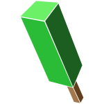
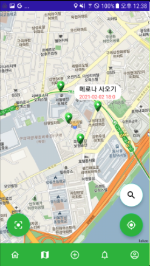

====

<h4>"올때, 메로나"</h4>
 

친구를 만나러 갈 때 장난처럼 한번쯤 들어 본적있는 부탁. 당신은 이 부탁을 얼마나 들어주었습니까?
진짜로 사가야지 라고 생각했다가 나도 모르게 그리고  그 친구도 모르게 잊어 버린적은 없습니까?

오늘은 정확하게 친구에게 리마인더를 해줍시다. 

"진짜로, *올때 메로나*"

Introduction
----
아이폰의 "미리 알림" 어플리케이션, 그 외 Todolist, Any.do, Do! 등 할일 목록 어플리케이션을 오마주 했으며 그 이상으로 추가적으로 메소드를 구현하여 더 발전된 할일 목록 어플리케이션을 제작했다. 추가적인 성능은 이와 같다.
* 지도로 할일 확인하기
* 사람들과 공유하기
* 한일 목록 및 레벨 시스템

Getting Started
---
* Merona Server: JSP, Spring 프로젝트
  * Oracle SQL 데이터 공간 (Merona) 설치 필수
* WhenYouComeMerona: 안드로이드 프로젝트
  * Kakao Maps Key 발급 필수
  * ip 주소 확인 필수 (업데이트 예정)

For more resources Contact: dkang0602@gmail.com

Screenshot
---

          

Link
---

<a href="https://www.notion.so/f000834936594e8c8219b7a9fb36659a?v=91d4b67c606a439b92def70e14cf7cb7">타임라인 :hourglass_flowing_sand:</a>
 
<a href="https://docs.google.com/presentation/d/e/2PACX-1vRKU6d9BuWP5ZnL-We3lp79Sc5VY4OvDuzjTXt4fqa_gi9x1XFxhYAi2JMTMLdSAODKNQiTIz8xFxPj/pub?start=false&loop=false&delayms=3000">PPT :eye_speech_bubble:</a>

